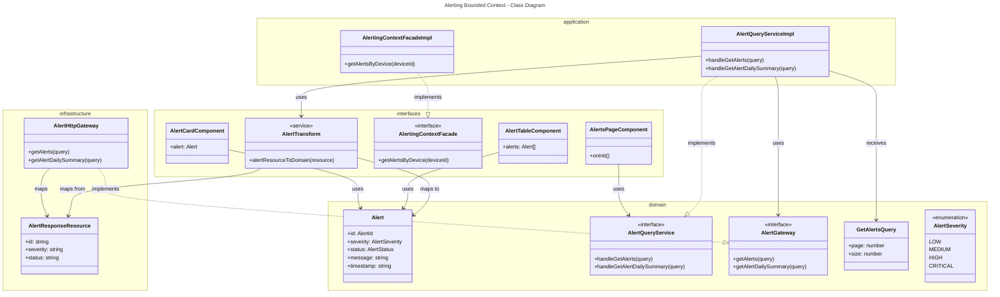
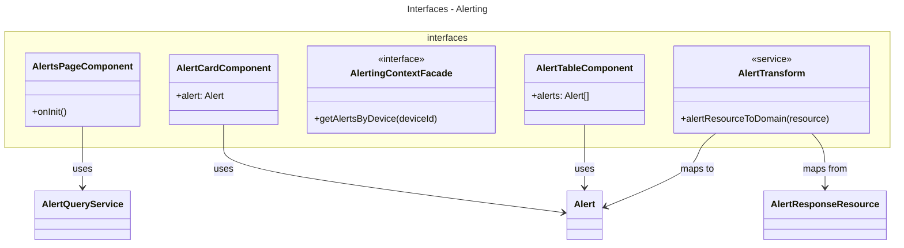
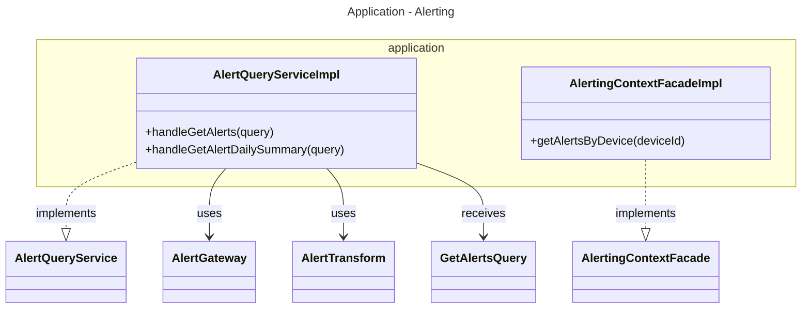
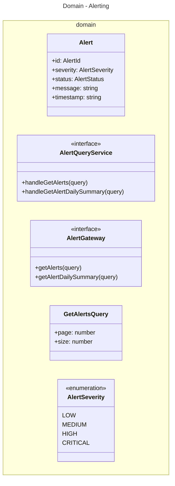
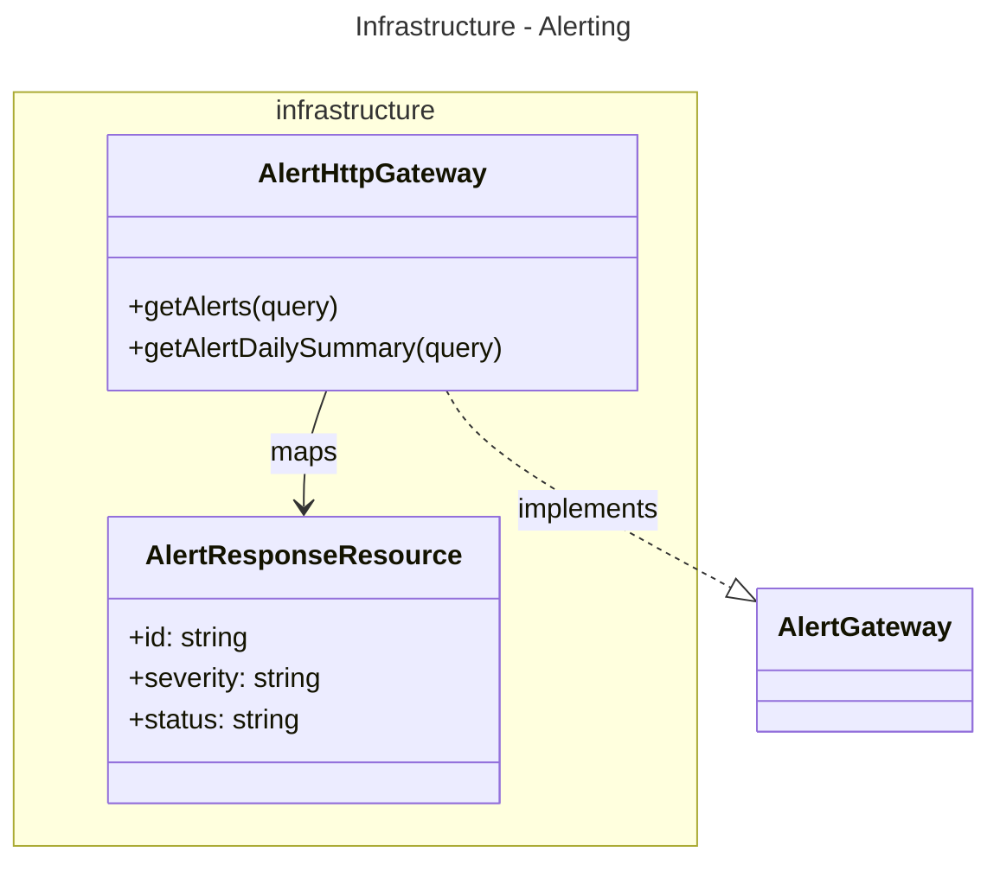

# Unified Class

```mermaid
---
title: Alerting Bounded Context - Class Diagram
---

classDiagram

namespace interfaces {
    class AlertsPageComponent {
        +onInit()
    }
    class AlertTransform {
        <<service>>
        +alertResourceToDomain(resource)
    }
    class AlertingContextFacade {
        <<interface>>
        +getAlertsByDevice(deviceId)
    }
    class AlertCardComponent {
        +alert: Alert
    }
    class AlertTableComponent {
        +alerts: Alert[]
    }
}

namespace application {
    class AlertQueryServiceImpl {
        +handleGetAlerts(query)
        +handleGetAlertDailySummary(query)
    }
    class AlertingContextFacadeImpl {
        +getAlertsByDevice(deviceId)
    }
}

namespace domain {
    class Alert {
        +id: AlertId
        +severity: AlertSeverity
        +status: AlertStatus
        +message: string
        +timestamp: string
    }
    class AlertQueryService {
        <<interface>>
        +handleGetAlerts(query)
        +handleGetAlertDailySummary(query)
    }
    class AlertGateway {
        <<interface>>
        +getAlerts(query)
        +getAlertDailySummary(query)
    }
    class GetAlertsQuery {
        +page: number
        +size: number
    }
    class AlertSeverity {
        <<enumeration>>
        LOW
        MEDIUM
        HIGH
        CRITICAL
    }
}

namespace infrastructure {
    class AlertHttpGateway {
        +getAlerts(query)
        +getAlertDailySummary(query)
    }
    class AlertResponseResource {
        +id: string
        +severity: string
        +status: string
    }
}

%% Relationships
AlertsPageComponent --> AlertQueryService : uses
AlertCardComponent --> Alert : uses
AlertTableComponent --> Alert : uses

AlertQueryServiceImpl ..|> AlertQueryService : implements
AlertingContextFacadeImpl ..|> AlertingContextFacade : implements

AlertQueryServiceImpl --> AlertGateway : uses
AlertQueryServiceImpl --> AlertTransform : uses

AlertHttpGateway ..|> AlertGateway : implements
AlertHttpGateway --> AlertResponseResource : maps

AlertTransform --> Alert : maps to
AlertTransform --> AlertResponseResource : maps from

AlertQueryServiceImpl --> GetAlertsQuery : receives
```

---

# Layers

## Interfaces - Alerting

```mermaid
---
title: Interfaces - Alerting
---
classDiagram
namespace interfaces {
    class AlertsPageComponent {
        +onInit()
    }
    class AlertTransform {
        <<service>>
        +alertResourceToDomain(resource)
    }
    class AlertingContextFacade {
        <<interface>>
        +getAlertsByDevice(deviceId)
    }
    class AlertCardComponent {
        +alert: Alert
    }
    class AlertTableComponent {
        +alerts: Alert[]
    }
}

%% External classes referenced
class Alert
class AlertQueryService
class AlertResponseResource

AlertsPageComponent --> AlertQueryService : uses
AlertCardComponent --> Alert : uses
AlertTableComponent --> Alert : uses
AlertTransform --> Alert : maps to
AlertTransform --> AlertResponseResource : maps from
```

## Application - Alerting

```mermaid
---
title: Application - Alerting
---
classDiagram
namespace application {
    class AlertQueryServiceImpl {
        +handleGetAlerts(query)
        +handleGetAlertDailySummary(query)
    }
    class AlertingContextFacadeImpl {
        +getAlertsByDevice(deviceId)
    }
}

%% External classes referenced
class AlertQueryService
class AlertingContextFacade
class AlertGateway
class AlertTransform
class GetAlertsQuery

AlertQueryServiceImpl ..|> AlertQueryService : implements
AlertingContextFacadeImpl ..|> AlertingContextFacade : implements
AlertQueryServiceImpl --> AlertGateway : uses
AlertQueryServiceImpl --> AlertTransform : uses
AlertQueryServiceImpl --> GetAlertsQuery : receives
```

## Domain - Alerting

```mermaid
---
title: Domain - Alerting
---
classDiagram
namespace domain {
    class Alert {
        +id: AlertId
        +severity: AlertSeverity
        +status: AlertStatus
        +message: string
        +timestamp: string
    }
    class AlertQueryService {
        <<interface>>
        +handleGetAlerts(query)
        +handleGetAlertDailySummary(query)
    }
    class AlertGateway {
        <<interface>>
        +getAlerts(query)
        +getAlertDailySummary(query)
    }
    class GetAlertsQuery {
        +page: number
        +size: number
    }
    class AlertSeverity {
        <<enumeration>>
        LOW
        MEDIUM
        HIGH
        CRITICAL
    }
}
```

## Infrastructure - Alerting

```mermaid
---
title: Infrastructure - Alerting
---
classDiagram
namespace infrastructure {
    class AlertHttpGateway {
        +getAlerts(query)
        +getAlertDailySummary(query)
    }
    class AlertResponseResource {
        +id: string
        +severity: string
        +status: string
    }
}

%% External classes referenced
class AlertGateway

AlertHttpGateway ..|> AlertGateway : implements
AlertHttpGateway --> AlertResponseResource : maps
```
