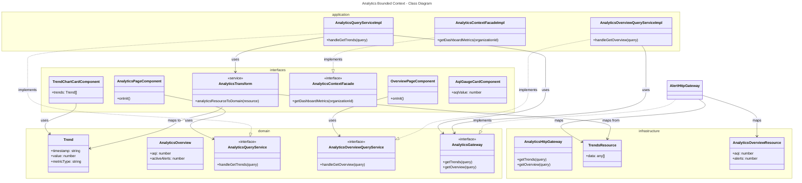

```mermaid
---
title: Analytics Bounded Context - Class Diagram
---

classDiagram

namespace interfaces {
    class AnalyticsPageComponent {
        +onInit()
    }
    class OverviewPageComponent {
        +onInit()
    }
    class AnalyticsTransform {
        <<service>>
        +analyticsResourceToDomain(resource)
    }
    class AnalyticsContextFacade {
        <<interface>>
        +getDashboardMetrics(organizationId)
    }
    class TrendChartCardComponent {
        +trends: Trend[]
    }
    class AqiGaugeCardComponent {
        +aqiValue: number
    }
}

namespace application {
    class AnalyticsQueryServiceImpl {
        +handleGetTrends(query)
    }
    class AnalyticsOverviewQueryServiceImpl {
        +handleGetOverview(query)
    }
    class AnalyticsContextFacadeImpl {
        +getDashboardMetrics(organizationId)
    }
}

namespace domain {
    class Trend {
        +timestamp: string
        +value: number
        +metricType: string
    }
    class AnalyticsOverview {
        +aqi: number
        +activeAlerts: number
    }
    class AnalyticsQueryService {
        <<interface>>
        +handleGetTrends(query)
    }
    class AnalyticsOverviewQueryService {
        <<interface>>
        +handleGetOverview(query)
    }
    class AnalyticsGateway {
        <<interface>>
        +getTrends(query)
        +getOverview(query)
    }
}

namespace infrastructure {
    class AnalyticsHttpGateway {
        +getTrends(query)
        +getOverview(query)
    }
    class TrendsResource {
        +data: any[]
    }
    class AnalyticsOverviewResource {
        +aqi: number
        +alerts: number
    }
}

%% Relationships
AnalyticsPageComponent --> AnalyticsQueryService : uses
OverviewPageComponent --> AnalyticsOverviewQueryService : uses
TrendChartCardComponent --> Trend : uses

AnalyticsQueryServiceImpl ..|> AnalyticsQueryService : implements
AnalyticsOverviewQueryServiceImpl ..|> AnalyticsOverviewQueryService : implements
AnalyticsContextFacadeImpl ..|> AnalyticsContextFacade : implements

AnalyticsQueryServiceImpl --> AnalyticsGateway : uses
AnalyticsOverviewQueryServiceImpl --> AnalyticsGateway : uses
AnalyticsQueryServiceImpl --> AnalyticsTransform : uses

AlertHttpGateway ..|> AnalyticsGateway : implements
AlertHttpGateway --> TrendsResource : maps
AlertHttpGateway --> AnalyticsOverviewResource : maps

AnalyticsTransform --> Trend : maps to
AnalyticsTransform --> TrendsResource : maps from
```
