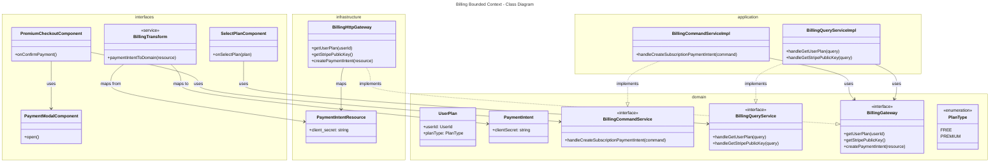

```mermaid
---
title: Billing Bounded Context - Class Diagram
---

classDiagram

namespace interfaces {
    class SelectPlanComponent {
        +onSelectPlan(plan)
    }
    class PremiumCheckoutComponent {
        +onConfirmPayment()
    }
    class PaymentModalComponent {
        +open()
    }
    class BillingTransform {
        <<service>>
        +paymentIntentToDomain(resource)
    }
}

namespace application {
    class BillingCommandServiceImpl {
        +handleCreateSubscriptionPaymentIntent(command)
    }
    class BillingQueryServiceImpl {
        +handleGetUserPlan(query)
        +handleGetStripePublicKey(query)
    }
}

namespace domain {
    class UserPlan {
        +userId: UserId
        +planType: PlanType
    }
    class PaymentIntent {
        +clientSecret: string
    }
    class BillingCommandService {
        <<interface>>
        +handleCreateSubscriptionPaymentIntent(command)
    }
    class BillingQueryService {
        <<interface>>
        +handleGetUserPlan(query)
        +handleGetStripePublicKey(query)
    }
    class BillingGateway {
        <<interface>>
        +getUserPlan(userId)
        +getStripePublicKey()
        +createPaymentIntent(resource)
    }
    class PlanType {
        <<enumeration>>
        FREE
        PREMIUM
    }
}

namespace infrastructure {
    class BillingHttpGateway {
        +getUserPlan(userId)
        +getStripePublicKey()
        +createPaymentIntent(resource)
    }
    class PaymentIntentResource {
        +client_secret: string
    }
}

%% Relationships
SelectPlanComponent --> BillingQueryService : uses
PremiumCheckoutComponent --> BillingCommandService : uses
PremiumCheckoutComponent --> PaymentModalComponent : uses

BillingCommandServiceImpl ..|> BillingCommandService : implements
BillingQueryServiceImpl ..|> BillingQueryService : implements

BillingCommandServiceImpl --> BillingGateway : uses
BillingQueryServiceImpl --> BillingGateway : uses

BillingHttpGateway ..|> BillingGateway : implements
BillingHttpGateway --> PaymentIntentResource : maps

BillingTransform --> PaymentIntent : maps to
BillingTransform --> PaymentIntentResource : maps from
```
