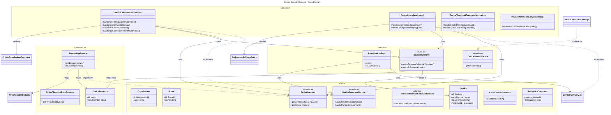

```mermaid
---
title: Device Bounded Context - Class Diagram
---

classDiagram

namespace interfaces {
    class SpaceDevicesPage {
        +onInit()
        +onClaimDevice()
    }
    class DeviceTransform {
        <<service>>
        +deviceResourceToDomain(resource)
        +deviceToResource(device)
    }
    class DeviceContextFacade {
        <<interface>>
        +getDeviceById(id)
    }
}

namespace application {
    class DeviceCommandServiceImpl {
        +handleCreateOrganization(command)
        +handleClaimDevice(command)
        +handlePairDevice(command)
        +handleQueueDeviceCommand(command)
    }
    class DeviceQueryServiceImpl {
        +handleGetDevicesBySpace(query)
        +handleGetOrganizationById(query)
    }
    class DeviceThresholdCommandServiceImpl {
        +handleCreateThreshold(command)
        +handleUpdateThreshold(command)
    }
    class DeviceThresholdQueryServiceImpl {
        +handleGetThresholdsByDevice(query)
    }
}

namespace domain {
    class Organization {
        +id: OrganizationId
        +name: string
    }
    class Space {
        +id: SpaceId
        +name: string
    }
    class Device {
        +id: DeviceId
        +serialNumber: string
        +status: DeviceStatus
        +hardwareId: HardwareId
    }
    class DeviceCommandService {
        <<interface>>
        +handleClaimDevice(command)
        +handlePairDevice(command)
    }
    class DeviceThresholdCommandService {
        <<interface>>
        +handleUpdateThreshold(command)
    }
    class DeviceGateway {
        <<interface>>
        +getDevicesBySpace(spaceId)
        +pairDevice(resource)
    }
    class ClaimDeviceCommand {
        +serialNumber: string
    }
    class PairDeviceCommand {
        +deviceId: DeviceId
        +pairingCode: string
    }
}

namespace infrastructure {
    class DeviceHttpGateway {
        +claimDevice(resource)
        +pairDevice(resource)
    }
    class DeviceThresholdHttpGateway {
        +getThresholds(deviceId)
    }
    class DeviceResource {
        +id: string
        +serialNumber: string
    }
}

%% Relationships
SpaceDevicesPage --> DeviceQueryService : uses
SpaceDevicesPage --> DeviceCommandService : uses

DeviceQueryServiceImpl ..|> DeviceQueryService : implements
DeviceCommandServiceImpl ..|> DeviceCommandService : implements
DeviceContextFacadeImpl ..|> DeviceContextFacade : implements

DeviceQueryServiceImpl --> DeviceGateway : uses
DeviceCommandServiceImpl --> DeviceGateway : uses

DeviceQueryServiceImpl --> DeviceTransform : uses
DeviceCommandServiceImpl --> DeviceTransform : uses

DeviceHttpGateway ..|> DeviceGateway : implements
DeviceHttpGateway --> DeviceResource : maps
DeviceHttpGateway --> OrganizationResource : maps

DeviceTransform --> Device : maps to
DeviceTransform --> DeviceResource : maps from

DeviceCommandServiceImpl --> CreateOrganizationCommand : receives
DeviceQueryServiceImpl --> GetDevicesBySpaceQuery : receives
```
