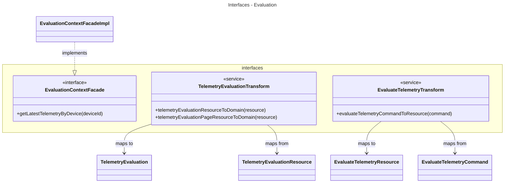
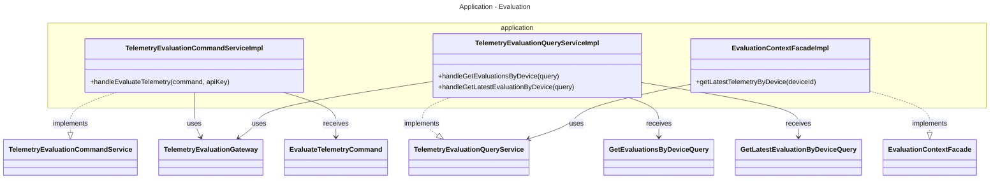
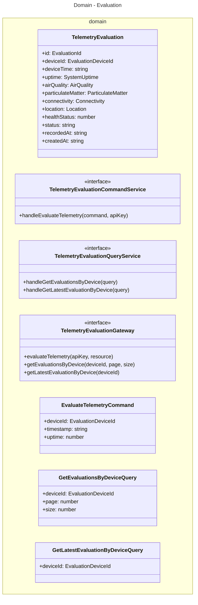
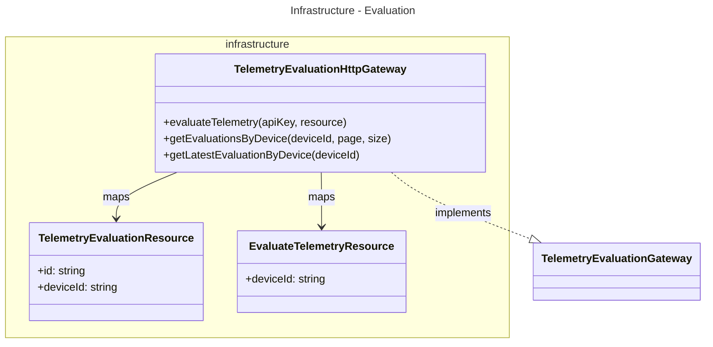

# Unified Class

```mermaid
---
title: Evaluation Bounded Context - Class Diagram
---

classDiagram

namespace interfaces {
    class EvaluationContextFacade {
        <<interface>>
        +getLatestTelemetryByDevice(deviceId)
    }
    class TelemetryEvaluationTransform {
        <<service>>
        +telemetryEvaluationResourceToDomain(resource)
        +telemetryEvaluationPageResourceToDomain(resource)
    }
    class EvaluateTelemetryTransform {
        <<service>>
        +evaluateTelemetryCommandToResource(command)
    }
}

namespace application {
    class TelemetryEvaluationCommandServiceImpl {
        +handleEvaluateTelemetry(command, apiKey)
    }
    class TelemetryEvaluationQueryServiceImpl {
        +handleGetEvaluationsByDevice(query)
        +handleGetLatestEvaluationByDevice(query)
    }
    class EvaluationContextFacadeImpl {
        +getLatestTelemetryByDevice(deviceId)
    }
}

namespace domain {
    class TelemetryEvaluation {
        +id: EvaluationId
        +deviceId: EvaluationDeviceId
        +deviceTime: string
        +uptime: SystemUptime
        +airQuality: AirQuality
        +particulateMatter: ParticulateMatter
        +connectivity: Connectivity
        +location: Location
        +healthStatus: number
        +status: string
        +recordedAt: string
        +createdAt: string
    }
    class TelemetryEvaluationCommandService {
        <<interface>>
        +handleEvaluateTelemetry(command, apiKey)
    }
    class TelemetryEvaluationQueryService {
        <<interface>>
        +handleGetEvaluationsByDevice(query)
        +handleGetLatestEvaluationByDevice(query)
    }
    class TelemetryEvaluationGateway {
        <<interface>>
        +evaluateTelemetry(apiKey, resource)
        +getEvaluationsByDevice(deviceId, page, size)
        +getLatestEvaluationByDevice(deviceId)
    }
    class EvaluateTelemetryCommand {
        +deviceId: EvaluationDeviceId
        +timestamp: string
        +uptime: number
    }
    class GetEvaluationsByDeviceQuery {
        +deviceId: EvaluationDeviceId
        +page: number
        +size: number
    }
    class GetLatestEvaluationByDeviceQuery {
        +deviceId: EvaluationDeviceId
    }
}

namespace infrastructure {
    class TelemetryEvaluationHttpGateway {
        +evaluateTelemetry(apiKey, resource)
        +getEvaluationsByDevice(deviceId, page, size)
        +getLatestEvaluationByDevice(deviceId)
    }
    class TelemetryEvaluationResource {
        +id: string
        +deviceId: string
    }
    class EvaluateTelemetryResource {
        +deviceId: string
    }
}

%% Relationships
EvaluationContextFacadeImpl ..|> EvaluationContextFacade : implements
TelemetryEvaluationCommandServiceImpl ..|> TelemetryEvaluationCommandService : implements
TelemetryEvaluationQueryServiceImpl ..|> TelemetryEvaluationQueryService : implements

TelemetryEvaluationCommandServiceImpl --> TelemetryEvaluationGateway : uses
TelemetryEvaluationQueryServiceImpl --> TelemetryEvaluationGateway : uses

TelemetryEvaluationHttpGateway ..|> TelemetryEvaluationGateway : implements
TelemetryEvaluationHttpGateway --> TelemetryEvaluationResource : maps
TelemetryEvaluationHttpGateway --> EvaluateTelemetryResource : maps

TelemetryEvaluationTransform --> TelemetryEvaluation : maps to
TelemetryEvaluationTransform --> TelemetryEvaluationResource : maps from

EvaluateTelemetryTransform --> EvaluateTelemetryResource : maps to
EvaluateTelemetryTransform --> EvaluateTelemetryCommand : maps from

EvaluationContextFacadeImpl --> TelemetryEvaluationQueryService : uses
TelemetryEvaluationCommandServiceImpl --> EvaluateTelemetryCommand : receives
TelemetryEvaluationQueryServiceImpl --> GetEvaluationsByDeviceQuery : receives
TelemetryEvaluationQueryServiceImpl --> GetLatestEvaluationByDeviceQuery : receives
```

---

# Layers

## Interfaces - Evaluation

```mermaid
---
title: Interfaces - Evaluation
---
classDiagram
namespace interfaces {
    class EvaluationContextFacade {
        <<interface>>
        +getLatestTelemetryByDevice(deviceId)
    }
    class TelemetryEvaluationTransform {
        <<service>>
        +telemetryEvaluationResourceToDomain(resource)
        +telemetryEvaluationPageResourceToDomain(resource)
    }
    class EvaluateTelemetryTransform {
        <<service>>
        +evaluateTelemetryCommandToResource(command)
    }
}

%% External classes referenced
class EvaluationContextFacadeImpl
class TelemetryEvaluation
class TelemetryEvaluationResource
class EvaluateTelemetryResource
class EvaluateTelemetryCommand

EvaluationContextFacadeImpl ..|> EvaluationContextFacade : implements
TelemetryEvaluationTransform --> TelemetryEvaluation : maps to
TelemetryEvaluationTransform --> TelemetryEvaluationResource : maps from
EvaluateTelemetryTransform --> EvaluateTelemetryResource : maps to
EvaluateTelemetryTransform --> EvaluateTelemetryCommand : maps from
```

## Application - Evaluation

```mermaid
---
title: Application - Evaluation
---
classDiagram
namespace application {
    class TelemetryEvaluationCommandServiceImpl {
        +handleEvaluateTelemetry(command, apiKey)
    }
    class TelemetryEvaluationQueryServiceImpl {
        +handleGetEvaluationsByDevice(query)
        +handleGetLatestEvaluationByDevice(query)
    }
    class EvaluationContextFacadeImpl {
        +getLatestTelemetryByDevice(deviceId)
    }
}

%% External classes referenced
class EvaluationContextFacade
class TelemetryEvaluationCommandService
class TelemetryEvaluationQueryService
class TelemetryEvaluationGateway
class EvaluateTelemetryCommand
class GetEvaluationsByDeviceQuery
class GetLatestEvaluationByDeviceQuery

EvaluationContextFacadeImpl ..|> EvaluationContextFacade : implements
TelemetryEvaluationCommandServiceImpl ..|> TelemetryEvaluationCommandService : implements
TelemetryEvaluationQueryServiceImpl ..|> TelemetryEvaluationQueryService : implements
TelemetryEvaluationCommandServiceImpl --> TelemetryEvaluationGateway : uses
TelemetryEvaluationQueryServiceImpl --> TelemetryEvaluationGateway : uses
EvaluationContextFacadeImpl --> TelemetryEvaluationQueryService : uses
TelemetryEvaluationCommandServiceImpl --> EvaluateTelemetryCommand : receives
TelemetryEvaluationQueryServiceImpl --> GetEvaluationsByDeviceQuery : receives
TelemetryEvaluationQueryServiceImpl --> GetLatestEvaluationByDeviceQuery : receives
```

## Domain - Evaluation

```mermaid
---
title: Domain - Evaluation
---
classDiagram
namespace domain {
    class TelemetryEvaluation {
        +id: EvaluationId
        +deviceId: EvaluationDeviceId
        +deviceTime: string
        +uptime: SystemUptime
        +airQuality: AirQuality
        +particulateMatter: ParticulateMatter
        +connectivity: Connectivity
        +location: Location
        +healthStatus: number
        +status: string
        +recordedAt: string
        +createdAt: string
    }
    class TelemetryEvaluationCommandService {
        <<interface>>
        +handleEvaluateTelemetry(command, apiKey)
    }
    class TelemetryEvaluationQueryService {
        <<interface>>
        +handleGetEvaluationsByDevice(query)
        +handleGetLatestEvaluationByDevice(query)
    }
    class TelemetryEvaluationGateway {
        <<interface>>
        +evaluateTelemetry(apiKey, resource)
        +getEvaluationsByDevice(deviceId, page, size)
        +getLatestEvaluationByDevice(deviceId)
    }
    class EvaluateTelemetryCommand {
        +deviceId: EvaluationDeviceId
        +timestamp: string
        +uptime: number
    }
    class GetEvaluationsByDeviceQuery {
        +deviceId: EvaluationDeviceId
        +page: number
        +size: number
    }
    class GetLatestEvaluationByDeviceQuery {
        +deviceId: EvaluationDeviceId
    }
}
```

## Infrastructure - Evaluation

```mermaid
---
title: Infrastructure - Evaluation
---
classDiagram
namespace infrastructure {
    class TelemetryEvaluationHttpGateway {
        +evaluateTelemetry(apiKey, resource)
        +getEvaluationsByDevice(deviceId, page, size)
        +getLatestEvaluationByDevice(deviceId)
    }
    class TelemetryEvaluationResource {
        +id: string
        +deviceId: string
    }
    class EvaluateTelemetryResource {
        +deviceId: string
    }
}

%% External classes referenced
class TelemetryEvaluationGateway

TelemetryEvaluationHttpGateway ..|> TelemetryEvaluationGateway : implements
TelemetryEvaluationHttpGateway --> TelemetryEvaluationResource : maps
TelemetryEvaluationHttpGateway --> EvaluateTelemetryResource : maps
```
