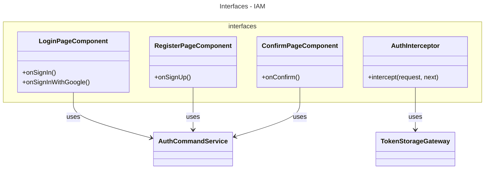
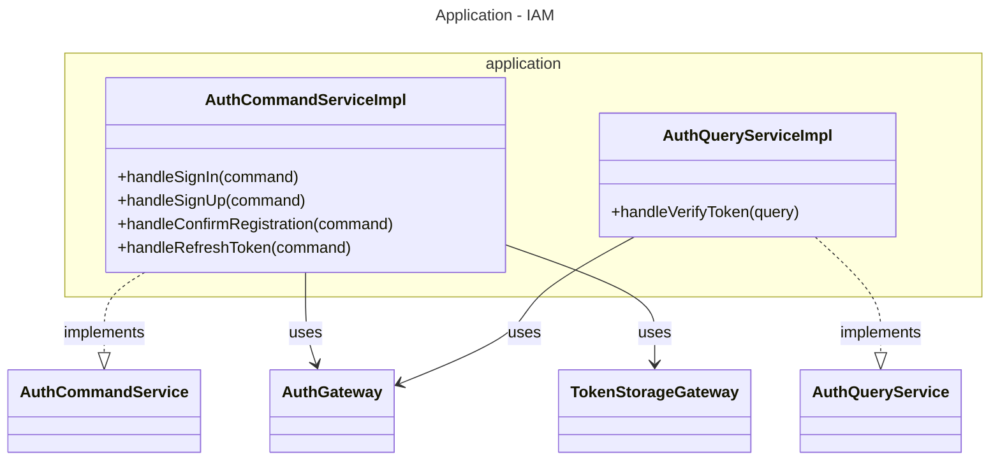
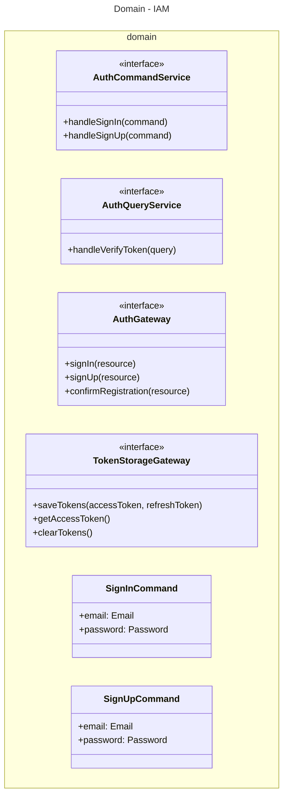
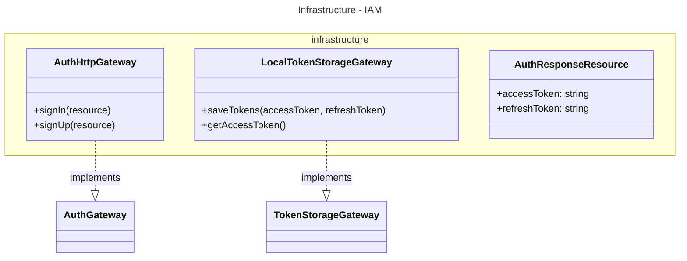

# Unified Class

```mermaid
---
title: IAM Bounded Context - Class Diagram
---

classDiagram

namespace interfaces {
    class LoginPageComponent {
        +onSignIn()
        +onSignInWithGoogle()
    }
    class RegisterPageComponent {
        +onSignUp()
    }
    class ConfirmPageComponent {
        +onConfirm()
    }
    class AuthInterceptor {
        +intercept(request, next)
    }
}

namespace application {
    class AuthCommandServiceImpl {
        +handleSignIn(command)
        +handleSignUp(command)
        +handleConfirmRegistration(command)
        +handleRefreshToken(command)
    }
    class AuthQueryServiceImpl {
        +handleVerifyToken(query)
    }
}

namespace domain {
    class AuthCommandService {
        <<interface>>
        +handleSignIn(command)
        +handleSignUp(command)
    }
    class AuthQueryService {
        <<interface>>
        +handleVerifyToken(query)
    }
    class AuthGateway {
        <<interface>>
        +signIn(resource)
        +signUp(resource)
        +confirmRegistration(resource)
    }
    class TokenStorageGateway {
        <<interface>>
        +saveTokens(accessToken, refreshToken)
        +getAccessToken()
        +clearTokens()
    }
    class SignInCommand {
        +email: Email
        +password: Password
    }
    class SignUpCommand {
        +email: Email
        +password: Password
    }
}

namespace infrastructure {
    class AuthHttpGateway {
        +signIn(resource)
        +signUp(resource)
    }
    class LocalTokenStorageGateway {
        +saveTokens(accessToken, refreshToken)
        +getAccessToken()
    }
    class AuthResponseResource {
        +accessToken: string
        +refreshToken: string
    }
}

%% Relationships
LoginPageComponent --> AuthCommandService : uses
RegisterPageComponent --> AuthCommandService : uses
ConfirmPageComponent --> AuthCommandService : uses

AuthCommandServiceImpl ..|> AuthCommandService : implements
AuthQueryServiceImpl ..|> AuthQueryService : implements

AuthCommandServiceImpl --> AuthGateway : uses
AuthCommandServiceImpl --> TokenStorageGateway : uses
AuthQueryServiceImpl --> AuthGateway : uses

AuthHttpGateway ..|> AuthGateway : implements
LocalTokenStorageGateway ..|> TokenStorageGateway : implements

AuthInterceptor --> TokenStorageGateway : uses
```

---

# Layers

## Interfaces - IAM

```mermaid
---
title: Interfaces - IAM
---
classDiagram
namespace interfaces {
    class LoginPageComponent {
        +onSignIn()
        +onSignInWithGoogle()
    }
    class RegisterPageComponent {
        +onSignUp()
    }
    class ConfirmPageComponent {
        +onConfirm()
    }
    class AuthInterceptor {
        +intercept(request, next)
    }
}

%% External classes referenced
class AuthCommandService
class TokenStorageGateway

LoginPageComponent --> AuthCommandService : uses
RegisterPageComponent --> AuthCommandService : uses
ConfirmPageComponent --> AuthCommandService : uses
AuthInterceptor --> TokenStorageGateway : uses
```

## Application - IAM

```mermaid
---
title: Application - IAM
---
classDiagram
namespace application {
    class AuthCommandServiceImpl {
        +handleSignIn(command)
        +handleSignUp(command)
        +handleConfirmRegistration(command)
        +handleRefreshToken(command)
    }
    class AuthQueryServiceImpl {
        +handleVerifyToken(query)
    }
}

%% External classes referenced
class AuthCommandService
class AuthQueryService
class AuthGateway
class TokenStorageGateway

AuthCommandServiceImpl ..|> AuthCommandService : implements
AuthQueryServiceImpl ..|> AuthQueryService : implements
AuthCommandServiceImpl --> AuthGateway : uses
AuthCommandServiceImpl --> TokenStorageGateway : uses
AuthQueryServiceImpl --> AuthGateway : uses
```

## Domain - IAM

```mermaid
---
title: Domain - IAM
---
classDiagram
namespace domain {
    class AuthCommandService {
        <<interface>>
        +handleSignIn(command)
        +handleSignUp(command)
    }
    class AuthQueryService {
        <<interface>>
        +handleVerifyToken(query)
    }
    class AuthGateway {
        <<interface>>
        +signIn(resource)
        +signUp(resource)
        +confirmRegistration(resource)
    }
    class TokenStorageGateway {
        <<interface>>
        +saveTokens(accessToken, refreshToken)
        +getAccessToken()
        +clearTokens()
    }
    class SignInCommand {
        +email: Email
        +password: Password
    }
    class SignUpCommand {
        +email: Email
        +password: Password
    }
}
```

## Infrastructure - IAM

```mermaid
---
title: Infrastructure - IAM
---
classDiagram
namespace infrastructure {
    class AuthHttpGateway {
        +signIn(resource)
        +signUp(resource)
    }
    class LocalTokenStorageGateway {
        +saveTokens(accessToken, refreshToken)
        +getAccessToken()
    }
    class AuthResponseResource {
        +accessToken: string
        +refreshToken: string
    }
}

%% External classes referenced
class AuthGateway
class TokenStorageGateway

AuthHttpGateway ..|> AuthGateway : implements
LocalTokenStorageGateway ..|> TokenStorageGateway : implements
```
