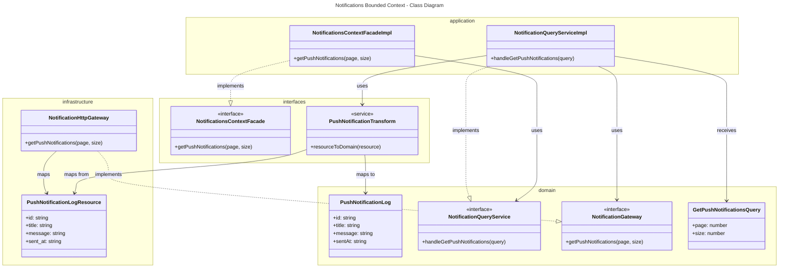
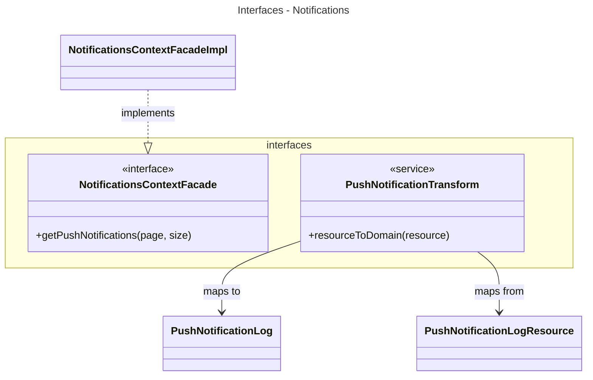
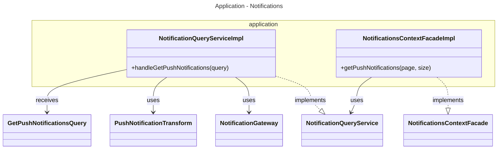
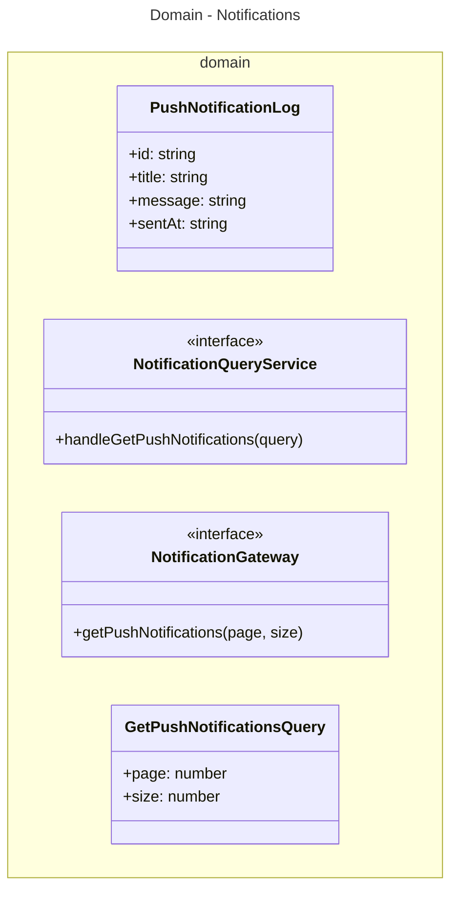
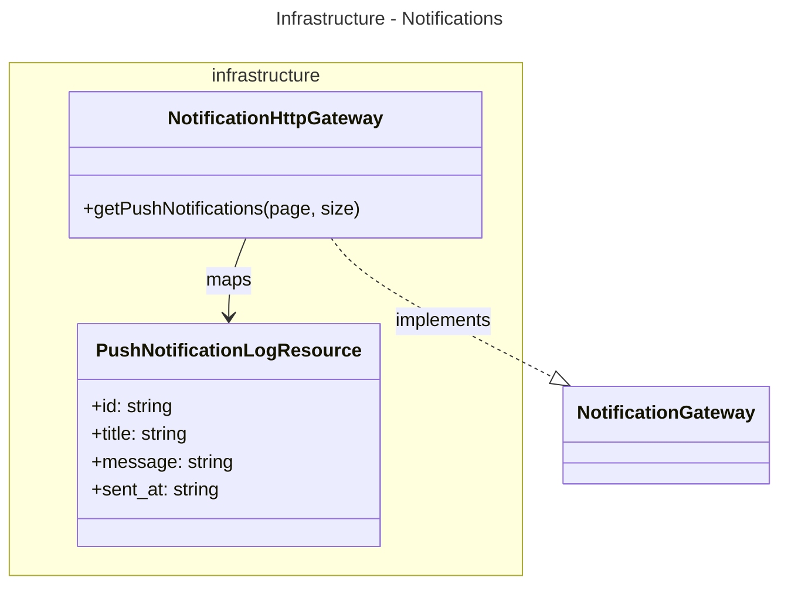

# Unified Class

```mermaid
---
title: Notifications Bounded Context - Class Diagram
---

classDiagram

namespace interfaces {
    class NotificationsContextFacade {
        <<interface>>
        +getPushNotifications(page, size)
    }
    class PushNotificationTransform {
        <<service>>
        +resourceToDomain(resource)
    }
}

namespace application {
    class NotificationQueryServiceImpl {
        +handleGetPushNotifications(query)
    }
    class NotificationsContextFacadeImpl {
        +getPushNotifications(page, size)
    }
}

namespace domain {
    class PushNotificationLog {
        +id: string
        +title: string
        +message: string
        +sentAt: string
    }
    class NotificationQueryService {
        <<interface>>
        +handleGetPushNotifications(query)
    }
    class NotificationGateway {
        <<interface>>
        +getPushNotifications(page, size)
    }
    class GetPushNotificationsQuery {
        +page: number
        +size: number
    }
}

namespace infrastructure {
    class NotificationHttpGateway {
        +getPushNotifications(page, size)
    }
    class PushNotificationLogResource {
        +id: string
        +title: string
        +message: string
        +sent_at: string
    }
}

%% Relationships
NotificationsContextFacadeImpl ..|> NotificationsContextFacade : implements
NotificationQueryServiceImpl ..|> NotificationQueryService : implements

NotificationsContextFacadeImpl --> NotificationQueryService : uses
NotificationQueryServiceImpl --> NotificationGateway : uses
NotificationQueryServiceImpl --> PushNotificationTransform : uses

NotificationHttpGateway ..|> NotificationGateway : implements
NotificationHttpGateway --> PushNotificationLogResource : maps

PushNotificationTransform --> PushNotificationLog : maps to
PushNotificationTransform --> PushNotificationLogResource : maps from

NotificationQueryServiceImpl --> GetPushNotificationsQuery : receives
```

---

# Layers

## Interfaces - Notifications

```mermaid
---
title: Interfaces - Notifications
---
classDiagram
namespace interfaces {
    class NotificationsContextFacade {
        <<interface>>
        +getPushNotifications(page, size)
    }
    class PushNotificationTransform {
        <<service>>
        +resourceToDomain(resource)
    }
}

%% External classes referenced
class NotificationsContextFacadeImpl
class PushNotificationLog
class PushNotificationLogResource

NotificationsContextFacadeImpl ..|> NotificationsContextFacade : implements
PushNotificationTransform --> PushNotificationLog : maps to
PushNotificationTransform --> PushNotificationLogResource : maps from
```

## Application - Notifications

```mermaid
---
title: Application - Notifications
---
classDiagram
namespace application {
    class NotificationQueryServiceImpl {
        +handleGetPushNotifications(query)
    }
    class NotificationsContextFacadeImpl {
        +getPushNotifications(page, size)
    }
}

%% External classes referenced
class NotificationsContextFacade
class NotificationQueryService
class NotificationGateway
class PushNotificationTransform
class GetPushNotificationsQuery

NotificationsContextFacadeImpl ..|> NotificationsContextFacade : implements
NotificationQueryServiceImpl ..|> NotificationQueryService : implements
NotificationsContextFacadeImpl --> NotificationQueryService : uses
NotificationQueryServiceImpl --> NotificationGateway : uses
NotificationQueryServiceImpl --> PushNotificationTransform : uses
NotificationQueryServiceImpl --> GetPushNotificationsQuery : receives
```

## Domain - Notifications

```mermaid
---
title: Domain - Notifications
---
classDiagram
namespace domain {
    class PushNotificationLog {
        +id: string
        +title: string
        +message: string
        +sentAt: string
    }
    class NotificationQueryService {
        <<interface>>
        +handleGetPushNotifications(query)
    }
    class NotificationGateway {
        <<interface>>
        +getPushNotifications(page, size)
    }
    class GetPushNotificationsQuery {
        +page: number
        +size: number
    }
}
```

## Infrastructure - Notifications

```mermaid
---
title: Infrastructure - Notifications
---
classDiagram
namespace infrastructure {
    class NotificationHttpGateway {
        +getPushNotifications(page, size)
    }
    class PushNotificationLogResource {
        +id: string
        +title: string
        +message: string
        +sent_at: string
    }
}

%% External classes referenced
class NotificationGateway

NotificationHttpGateway ..|> NotificationGateway : implements
NotificationHttpGateway --> PushNotificationLogResource : maps
```
